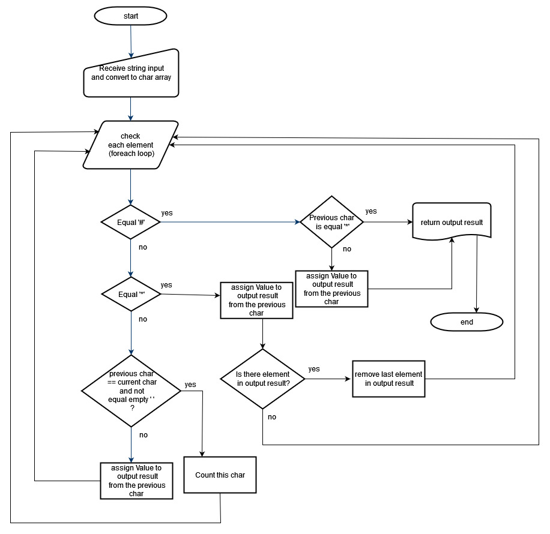

# PhonePad
 Old Phone keypad is a program to identify the alphabetical letters from number keys, a backspace key, and a send button. Each button has a number to identify it and pressing a button multiple times will cycle through the letters on it allowing each button to represent more than one letter.

For example, pressing 2 once will return 'A' but pressing twice in succession will return 'B'. If you pause for a second in order to type two characters from the same button after each other: "222 2 22" -> "CAB".

Example  
"33#" => "E"  
"227*#" => "B"
"4433555 555666#" => "HELLO"  
"8 88777444666*664#" => "TURING"  

## Tool
* .Net Core 6.0
* Visual studio 2022
## Usage
**NumberMapChar** this class use to store the relationship between the key and letters such as '2' represent of 'A','B','C' letters.
```cs
    public class NumberMapChar
    {
        public char key { get; set; }
        public char[] chars { get; set; }
    }
```
**NumberMapCharList** this class use to store all possible values of NumberMapChar class (key from 0-9, ).
```cs
  public class NumberMapCharList
    {

        public static List<NumberMapChar> list => numberMapChars();

        public static List<NumberMapChar> numberMapChars()
        {
            return new List<NumberMapChar>() {
                    new NumberMapChar(){
                        key = '0',
                        chars = new char[1]{' ' }
                    },
                    new NumberMapChar(){
                        key = '1',
                        chars = new char[3]{'&','\'','(' }
                    },
                    new NumberMapChar(){
                        key = '2',
                        chars = new char[3]{'A','B','C' }
                    },
                    new NumberMapChar(){
                        key = '3',
                        chars = new char[3]{'D','E','F' }
                    },
                    new NumberMapChar(){
                        key = '4',
                        chars = new char[3]{'G','H','I' }
                    },
                    new NumberMapChar(){
                        key = '5',
                        chars = new char[3]{'J','K','L' }
                    },
                    new NumberMapChar(){
                        key = '6',
                        chars = new char[3]{'M','N','O' }
                    },
                    new NumberMapChar(){
                        key = '7',
                        chars = new char[4]{'P','Q','R','S' }
                    },
                    new NumberMapChar(){
                        key = '8',
                        chars = new char[3]{'T','U','V' }
                    },
                    new NumberMapChar(){
                        key = '9',
                        chars = new char[4]{'W','X','Y','Z' }
                    }
            };


        }
    }
```
The starting point of program begin with **Program.cs**. The program call static method of **MainKeyPad** class (OldPhonePad method).The first step we convert input string to be array of char as below.
```cs
  char[] arr = inputString.ToCharArray(0, inputString.Length);
```
The process of program is inside **OldPhonePad** method of MainKeyPad class like a flow chart below.


From the process *"assign Value to output result from the previous char"* this process is inner method inside **OldPhonePad** method. The code as below.
```cs
   void assignValue()
   {
       numberMap = charList.FirstOrDefault(x => x.key == previousCh);
       if (numberMap != null)
       {
           /***If user press more than maximium of possible value, find the value by iterative retrieve ***/
           int indexCh = countChar % numberMap.chars.Length;
           resultCh.Add(numberMap.chars[indexCh == 0 ? numberMap.chars.Length - 1 : indexCh - 1]);
       }
   }
```
## Unit Test
This project contain unit test(xUnit) project name as **"TestPhonePad"**. From the unit test we have one method name as *"Test_oldPhonePad_should_be_same"*.
At the beginning of the code we prepare 4 test cases with *Dictionary* variable. This variable contain input and expected output. If the method of *"OldPhonePad"* process correctly the result should equal expected result.
```cs
  [Fact]
  public void Test_oldPhonePad_should_be_same()
  {
      Dictionary<string, string> testData =new Dictionary<string, string>();
      testData.Add("33#", "E");
      testData.Add("227*#", "B");
      testData.Add("4433555 555666#", "HELLO");
      testData.Add("8 88777444666*664#", "TURING");
      foreach (var aTestData in testData) {
          Assert.Equal(MainKeyPad.OldPhonePad(aTestData.Key), aTestData.Value);
      }
  }
```
